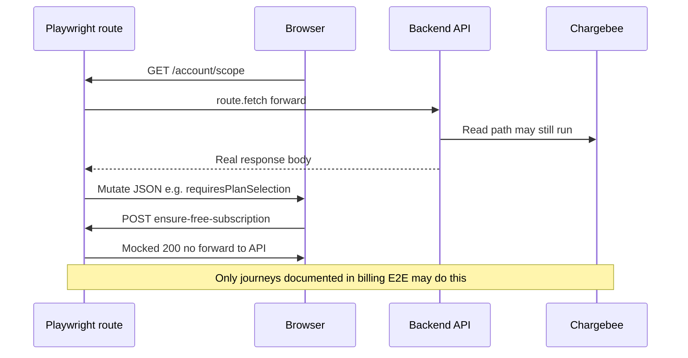

# E2E Discipline (Playwright)

This is the discipline note for end-to-end testing in this repository. Agents and humans implementing features must read this together with `TDD.md` and `MICROSERVICE-ARCH.md`.

## Where the suite lives

- Specs, helpers, fixtures, and config: `cloud-jpegs3-frontend/e2e/`.
- Playwright config: `cloud-jpegs3-frontend/playwright.config.ts` (`testDir: ./e2e`).
- Detailed authoring rules and folder shape: `cloud-jpegs3-frontend/e2e/README.md`.

## Hard rules (no exceptions)

1. **No mocked backend behavior** inside specs. No `page.route()` for backend endpoints.
2. **Documented exception — Chargebee billing gate:** specs listed under [Chargebee billing gate E2E](doc-internal/features/billing/e2e-chargebee-billing-gate.md) may mock **`POST /account/chargebee/ensure-free-subscription`** (no Chargebee writes) and may **mutate** the JSON of **`GET /account/scope`** after `route.fetch()` so the read path still hits the real API. Do not copy this pattern to other journeys without an ADR/E2E doc update.

### Chargebee exception (sequence)

3. **Real browser actions** for user-facing flows. API-level assertions use `page.request` against the real backend.
4. **Environment-agnostic.** The same spec runs against `local`, `dev1`, `prod`, and any `uat-*` target via `E2E_TARGET` (and optional URL overrides).
5. **No hardcoded hosts** (e.g. `127.0.0.1:8081`) in specs. Use the env resolver in `e2e/config/environments.ts`.
6. **One behavior per test**, with a stable `TC-...` id.
7. **Deterministic test data** via `makeTestEntityName(tcId, label)`. Names embed run id + target so artifacts are auditable / greppable.
8. **Self-contained setup** by default: each test seeds its prerequisites via real API. Cross-file ordering is not allowed; use `test.describe.configure({ mode: 'serial' })` inside one file when an A→B chain is real.
9. **Personas, not personal accounts.** Use the `owner` storage state produced by `auth.setup.ts`. Future personas (member, readonly) follow the same pattern.

## Run commands

From `cloud-jpegs3-frontend/`:

- `bun run test:e2e` — defaults `E2E_TARGET=local`.
- `E2E_TARGET=dev1 bun run test:e2e` — point at dev1.
- `make test-e2e-env` — sources `${ENV_FILE:-.env.e2e.dev1}` first.
- `make test-e2e-env-ui` — Playwright UI variant of the env-file flow.
- `make test-e2e-stress` — 8 workers.

## Authoring a new test (checklist)

1. Pick a journey and a stable `TC-*` id; if missing, extend the matching `doc-internal/features/**/e2e-*.md` matrix.
2. Add the spec under `cloud-jpegs3-frontend/e2e/<journey>.spec.ts` (or extend an existing one).
3. Generate test-data names via `makeTestEntityName`.
4. Validate backend liveness with `assertBackendLive`.
5. Seed prerequisites via `page.request` using the cached owner-authorization helper.
6. Drive the UI; assert visible behavior plus API-level contract when needed.
7. Flip the matching `doc-internal/features/**/e2e-*.md` row from `Planned`/`TBD` to `Automated` with the spec path.

## What does NOT belong in this suite

- Tests that require **mocked backend behavior** (failure injection, presign 500, rollback on PATCH 500, S3 cleanup verification). These are either out-of-scope or live in backend tests.
  - **Exception:** [Chargebee billing gate E2E](doc-internal/features/billing/e2e-chargebee-billing-gate.md) documents the only approved `page.route` pattern for backend URLs (mock POST ensure + mutate GET scope after `route.fetch()`).
- Tests that need **direct DB access**. Use backend integration tests.
- Tests that need **time travel** for date logic. Rewrite the scenario or document as backlog.

## Coverage status

- Canonical inventory of automated / dropped / backlog TCs: `cloud-jpegs3-frontend/e2e/README.md`.
- Per-feature matrices: `doc-internal/features/**/e2e-*.md`.

## Related discipline docs

- `TDD.md` — red-green-refactor and the iron law for production code.
- `MICROSERVICE-ARCH.md` — service boundaries, communication, observability.
- `cloud-jpegs3-frontend/e2e/README.md` — Playwright-level authoring rules.
