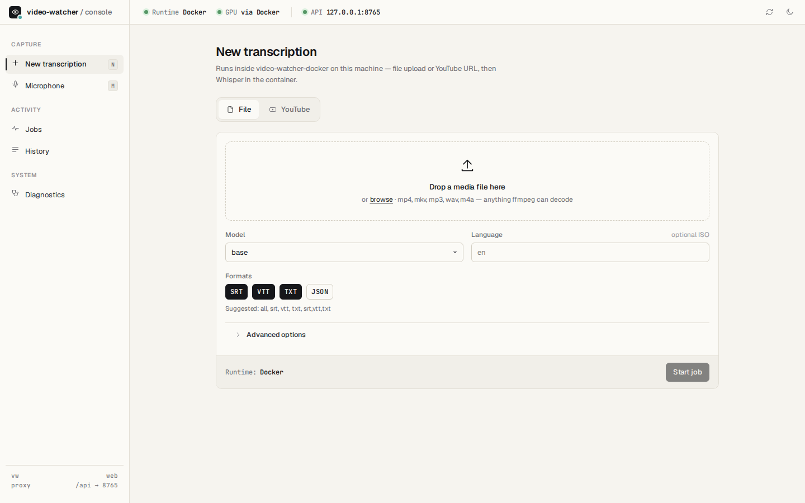
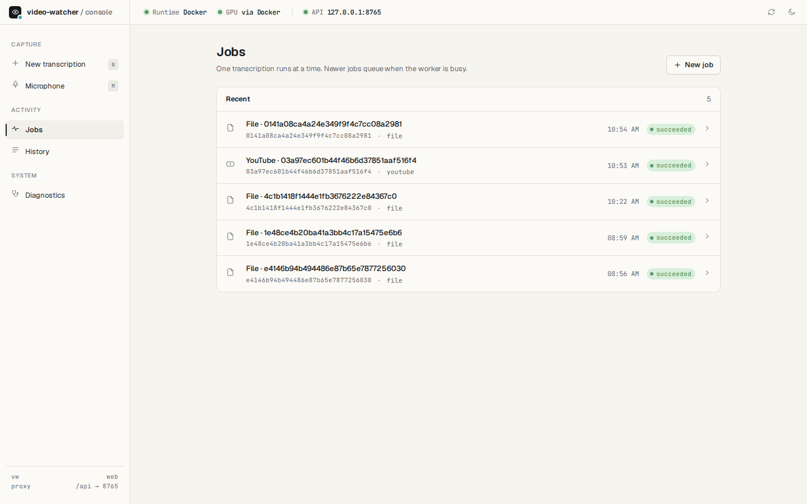
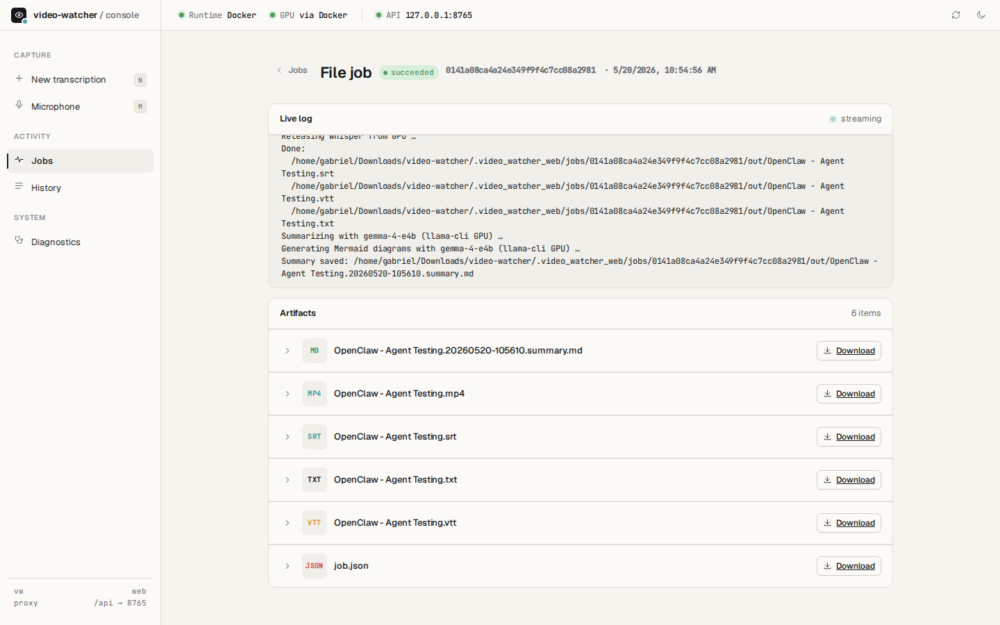
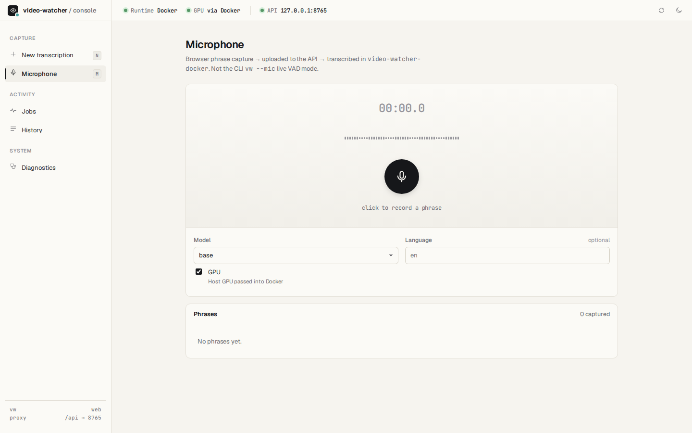
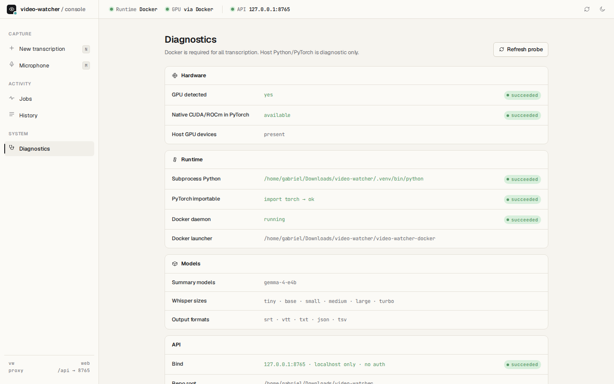

# video-watcher

**video-watcher** transcribes audio and video on your machine, then optionally summarizes the transcript with a local LLM. Feed it common **video** files (**mp4**, **mkv**, **webm**, **mov**, **avi**, **m4v**, **flv**, **ts**, **m2ts**) or **audio** (**mp3**, **wav**, **flac**, **ogg**, **opus**, **m4a**, **aac**, **wma**) — plus anything else **ffmpeg** can decode — and get searchable captions and plain-text transcripts. From there you can **search** the text and **chat with an LLM** about what was said in the recording (CLI, web console, or your own tools on the output files).

Local captions (SRT, VTT, TXT) via [OpenAI Whisper](https://github.com/openai/whisper). No API key. Optional **live microphone** (VAD) and **llama.cpp** transcript summaries. For a full list of behavior, see [Implemented features](#implemented-features).

**Input formats:** anything **ffmpeg** can decode. List known extensions:

```bash
./video-watcher --list-inputs
```

| Video | Audio |
|-------|-------|
| mp4, mkv, webm, mov, avi, m4v, flv, ts, m2ts | mp3, wav, flac, ogg, opus, m4a, aac, wma |

Other `audio/*` or `video/*` files (by MIME type) are accepted too.

## How it works

`video-watcher` runs [OpenAI Whisper](https://github.com/openai/whisper) on your file. **ffmpeg** decodes the audio; **Whisper** transcribes it. There is no intermediate MP3 on disk — audio stays in memory.


1. **ffmpeg** reads the media file (video or audio), extracts the audio track, and streams **mono 16 kHz PCM** to Python via a pipe (not a temp file). **Microphone mode** (`--mic`) does not use ffmpeg for capture; it uses **sounddevice** / PortAudio and resamples to 16 kHz in Python.
2. Whisper converts that waveform into a **log-mel spectrogram** — the representation the model was trained on.
3. The **Whisper model** processes the spectrogram in ~30 second chunks and predicts text (optionally forced to a language with `-l`).
4. Caption files are written next to the input (or under `-o`).

`video-watcher` adds a small CLI on top of Whisper: models, language, output directory, GPU, optional **live microphone** (VAD + threaded capture), and optional **llama.cpp summarization** after file transcription. `video-watcher-docker` runs the same tools in a container (ffmpeg, PyTorch, Whisper, PortAudio for mic).

## Scripts

| Script | Path | Purpose |
|--------|------|---------|
| **video-watcher-docker** | Docker | Check deps, build image, transcribe (auto GPU) |
| **install-local** | Local | Install CPU Whisper into `.venv` |
| **install-gpu** | Local | Install AMD ROCm PyTorch + Whisper into `.venv` |
| **setup-rocm** | Local | Alias for `install-gpu` (back-compat) |
| **video-watcher** | Local | Transcribe media files or run `--mic` (after install) |
| **docker compose up** | Docker | Start the **web console** (API + UI containers) |
| **video-watcher-web** | Deprecated | Alias for `docker compose up --build` |

```
video-watcher/
  vw/                     # Python package: cli, transcribe, mic, progress, cache, summary, media
  video-watcher-docker    # Docker: check → build → run
  install-local           # Local CPU setup
  install-gpu             # Local AMD GPU setup
  setup-rocm              # Alias for install-gpu
  video-watcher           # Launcher → python -m vw
  docker-compose.yml      # Web console: API + UI (docker compose up --build)
  video-watcher-web       # Deprecated → docker compose up --build
  web/                    # Local FastAPI + Vite UI (see “Web console” below)
  .venv/                  # Created by install-* scripts
```

## Web console (Docker Compose)

Browser UI and API run **only in containers** (decision record: `doc-internal/features/web-ui/adr-web-console.md`). From the repository root:

```bash
docker compose up --build
```

Then open **http://127.0.0.1:8080** (UI). The API is on port **8765**; nginx in the UI container proxies `/api` to the API service. All transcription (file jobs, YouTube, browser mic) runs **`python -m vw`** inside the API container.

| Service | Port | Role |
|---------|------|------|
| `ui` | 8080 (default) | Static React app + `/api` proxy |
| `api` | 8765 | FastAPI, job queue, Whisper subprocess |

Override ports: `VIDEO_WATCHER_UI_PORT`, `VIDEO_WATCHER_WEB_PORT`. Job workspaces and model cache use Docker volumes (`vw-jobs`, `vw-cache`).



| | |
|---|---|
|  |  |
|  |  |

**Deprecated:** `./video-watcher-web`, host `npm run dev`, and host uvicorn — they now print a message and run `docker compose up --build` instead.

**API tests** (fake `vw` runner; no containers):

```bash
.venv/bin/pip install -r web/api/requirements.txt
cd web/api && ../../.venv/bin/python -m pytest tests/ -q
```

Useful environment variables (Compose): `VIDEO_WATCHER_WEB_JOBS_DIR`, `VIDEO_WATCHER_CACHE`, `VIDEO_WATCHER_WEB_HOST` / `VIDEO_WATCHER_WEB_PORT`. For pytest: `VIDEO_WATCHER_WEB_FAKE_RUNNER=1`. `GET /api/meta` reports `container_runtime` and `subprocess_torch_import_ok`.

## Docker (recommended)

```bash
./video-watcher-docker                              # check + build image
./video-watcher-docker ~/Downloads/your-video.mp4   # transcribe
./video-watcher-docker -m turbo -l en ~/Downloads/talk.mp4
./video-watcher-docker --yt --gpu -m large -l en 'https://www.youtube.com/watch?v=VIDEO_ID'
./video-watcher-docker --check                      # dependency report only
./video-watcher-docker --cpu ~/Downloads/foo.mp4     # force CPU image
```

Auto-detects **CPU**, **NVIDIA**, or **AMD ROCm** and picks the matching image. Runs entirely in the container and exits on failure (no host fallback). The ROCm image builds **HIP `llama-cli`** so `--gpu --summary` uses the GPU for Whisper and Gemma (rebuild with `--rebuild` after upgrading).

### Microphone in Docker (experimental)

```bash
./video-watcher-docker --mic -m turbo -l en --gpu   # transcribe each phrase after a pause
./video-watcher-docker --mic -m turbo -o ~/Downloads # also append to ~/Downloads/mic-*.txt
```

`video-watcher-docker` checks the host for **ALSA** (`/dev/snd`) and **PulseAudio/PipeWire** (`$XDG_RUNTIME_DIR/pulse/native`), passes them into the container, and **rebuilds the image automatically** if `sounddevice` is missing. Images include `libportaudio2` and `sounddevice` (install via the venv’s `python -m pip` on GPU images).

Mic mode uses **VAD** (voice activity detection): it listens continuously, and when you **pause** (~0.6 s silence) it runs Whisper on that phrase. **Capture runs in a background thread** so the mic keeps recording while Whisper works — you should not lose words that come in during inference. Text still appears after each pause, not word-by-word. Records at the device’s native sample rate (often 48 kHz) and resamples to 16 kHz for Whisper. Use `-m turbo --gpu` for best accuracy. If inference falls behind realtime, phrases queue in memory until caught up. Manual rebuild after upgrading: `./video-watcher-docker --rebuild`.

## Local (native)

```bash
./install-local
./video-watcher ~/Downloads/your-video.mp4
```

### Microphone (experimental)

```bash
./video-watcher --mic -m turbo -l en --gpu    # transcribe each phrase after a pause
./video-watcher --mic -m turbo -o ./out       # also append to ./out/mic-*.txt
# Ctrl+C to stop (flushes the last phrase if you were mid-sentence)
```

Uses **sounddevice** (installed by `install-local` / `install-gpu`) and the system **PortAudio** library (`sudo apt install libportaudio2` on Ubuntu). **VAD** detects when you finish a phrase (~0.6 s pause), then runs Whisper on that audio. **Recording does not pause during transcription**, so speech during slow inference is still captured. Text appears shortly after each pause, not while you talk. `-m turbo --gpu` is recommended for accuracy and speed.

### AMD GPU (local)

```bash
./install-gpu
./video-watcher --gpu -m small ~/Downloads/your-video.mp4
# higher quality, still fast on GPU:
./video-watcher --gpu -m turbo -l en ~/Downloads/your-video.mp4
```

Reinstall ROCm stack: `./install-gpu --force`

If GPU is not detected on RX 6800 / Navi 21:

```bash
export HSA_OVERRIDE_GFX_VERSION=10.3.0
./install-gpu --force
```

## Options (`video-watcher` / `video-watcher-docker`)

| Flag | Meaning |
|------|---------|
| `-m MODEL` | Whisper model: `tiny`, `base`, `small`, `medium`, `large`, `turbo` (default: `base`, or `WHISPER_MODEL`) |
| `-l en` | Force language (default: auto-detect) |
| `-f srt,vtt,…` | Output formats: `srt`, `vtt`, `txt`, `json`, `tsv`, or `all` (default) |
| `--gpu` | Use GPU (local: after `install-gpu`; docker: automatic when available) |
| `--verbose` | Print live transcript text instead of the progress bar |
| `--mic` | Transcribe from the default microphone on pause (VAD; experimental; Ctrl+C to stop) |
| `-o ./out` | Output folder for caption files (with `--mic`, writes `mic-YYYYMMDD-HHMMSS.txt`) |
| `--list-inputs` | Print supported media extensions and exit |
| `--yt` | Treat inputs as **YouTube URLs**: captions via [yt-dlp](https://github.com/yt-dlp/yt-dlp), then [youtube-transcript-api](https://github.com/jdepoix/youtube-transcript-api) if needed; if there are no captions, **download audio** with yt-dlp and run **Whisper** (`vw/yt.py`). |
| `--summary` | After transcribe: summarize `.txt` with llama.cpp + Mermaid diagrams |
| `--summarize` | Same as `--summary` |
| `--summary-model` | Summary model key (default: `gemma-4-e4b`; more models later) |

**Constraints:** `--summary` / `--summarize` is not supported with `--mic`. With `--mic`, `--verbose` has no effect (phrase text is always printed). `--mic` with extra file paths prints a warning and ignores those paths. **`--yt` is not supported with `--mic`.** With **`--yt`**, outputs go to **`-o` / `--output-dir`** if set, otherwise the **current working directory** (there is no input file directory). **`--yt`** installs **yt-dlp** and **youtube-transcript-api** with `install-local` / `install-gpu` / Docker images; **audio fallback** still requires **yt-dlp** on `PATH` or as `python -m yt_dlp`.

**Docker-only** (`video-watcher-docker` before media paths):

| Flag | Meaning |
|------|---------|
| `--check` | Dependency report only (no build, no run) |
| `--rebuild` | Force rebuild of the selected image |
| `--cpu` | Use CPU image even when a GPU is detected |

`--mic` in Docker uses host audio passthrough (see [Microphone in Docker](#microphone-in-docker-experimental)). There is **no host `.venv` fallback** for file runs in Docker — use `./video-watcher` on the host if you prefer native execution.

### Whisper models

| Model | Size (approx.) | Use when |
|-------|----------------|----------|
| `tiny` | 72 MB | Fastest drafts |
| `base` | 140 MB | Default; quick runs |
| `small` | 460 MB | Good daily balance with `--gpu` |
| `medium` | 1.4 GB | Higher accuracy, slower |
| `large` | 2.9 GB | Best quality (`large-v3`) |
| `turbo` | 1.5 GB | Near-`large` quality, much faster (`large-v3-turbo`) |

Weights download on first use into `~/.video_watcher/whisper/` with a progress bar. The CLI prints status before audio decode, model load, and download so long first runs are not silent.

Run `video-watcher --help` for environment variables (also listed below).

## Convenience symlink

From anywhere:

```bash
~/Downloads/vw ~/Downloads/foo.mp4
```

(`vw` → `video-watcher/video-watcher` for local, or point at `video-watcher-docker` for Docker)

## Docker images (manual)

`./video-watcher-docker` handles this automatically.

| Image | Dockerfile | GPU |
|-------|------------|-----|
| `video-watcher:cpu` | `Dockerfile` | — |
| `video-watcher:nvidia` | `Dockerfile.nvidia` | NVIDIA + [Container Toolkit](https://docs.nvidia.com/datacenter/cloud-native/container-toolkit/install-guide.html) |
| `video-watcher:rocm` | `Dockerfile.rocm` | AMD `/dev/kfd` + `/dev/dri` |

### Run as your user

Containers start as **your UID/GID** (`--user $(id -u):$(id -g)` on Docker, `--userns=keep-id` on Podman), so caption files on mounted folders are owned by you, not root.

Whisper models are cached on the host at `~/.video_watcher/whisper` (set `VIDEO_WATCHER_CACHE` to use a different folder). The directory is created automatically on first run.

## YouTube (`--yt`)

Pass **watch**, **shorts**, or **youtu.be** URLs as inputs. The tool tries **yt-dlp** subtitles first, then **youtube-transcript-api** if no subtitle file was produced; if there is still no text track, it **downloads audio** with yt-dlp and runs **Whisper**. Outputs are named **`{VIDEO_ID}.srt`** (and other formats from `-f`). Default output directory is the **current working directory** unless you set **`-o` / `--output-dir`**. **`--summary`** / **`--summarize`** runs on the generated **`{VIDEO_ID}.txt`** like file mode.

```bash
./video-watcher --yt -o ~/Downloads "https://www.youtube.com/watch?v=jNQXAC9IVRw"
./video-watcher --yt -l en -f srt,vtt,txt -o ~/Downloads "https://youtu.be/jNQXAC9IVRw"
```

## Summarize transcript (`--summary`)

After transcription, optionally summarize the `.txt` output with **llama.cpp** (default model: **Gemma 4 E4B** GGUF).

**Requires:** `llama-cli` on `PATH`, or set `VIDEO_WATCHER_LLAMA_CLI` to your build (e.g. `~/llama.cpp/build/bin/llama-cli`).

```bash
./video-watcher -m small -l en --summary ~/Downloads/talk.mp4
# → talk.txt + talk.20260519-153045.summary.md (timestamp avoids overwrite)
# Summary markdown is printed to the terminal and saved to the file.
# A second pass adds Mermaid diagrams (flowchart, sequence, ER, etc.) for graph-worthy blocks.
```

The GGUF is downloaded once to `~/.video_watcher/llama/` (~5 GB for Gemma 4 E4B Q4). Use `--gpu` so both Whisper and the summarizer can use the GPU. More summary models will be added later (`--summary-model`).

## Environment variables

| Variable | Applies to | Meaning |
|----------|------------|---------|
| `WHISPER_MODEL` | local | Default `-m` if omitted (e.g. `small`, `turbo`) |
| `VIDEO_WATCHER_CACHE` | local, Docker | Model cache root (default: `~/.video_watcher`) |
| `VIDEO_WATCHER_PYTHON` | launcher | Python binary for `video-watcher` script |
| `VIDEO_WATCHER_LLAMA_CLI` | local | Path to `llama-cli` for `--summary` |
| `VIDEO_WATCHER_SUMMARY_MODEL` | local | Default `--summary-model` |
| `XDG_CACHE_HOME` | local | Set to the cache root path when `vw` runs (`vw/cache.py` `setup_cache`; aligns with `VIDEO_WATCHER_CACHE`) |
| `VIDEO_WATCHER_DATA` | Docker | Host folder mounted as `/data` (default: `~/Downloads`) |
| `CONTAINER_RUNTIME` | Docker | `docker` (default) or `podman` |
| `HSA_OVERRIDE_GFX_VERSION` | local, Docker | AMD workaround (e.g. `10.3.0` for RX 6000 / Navi 21) |

## Implemented features

This section is the **canonical list** of what the current codebase supports. Module names refer to the `vw/` package.

### YouTube (`--yt`)

| Capability | Details |
|------------|---------|
| **URLs** | `youtube.com/watch`, `/shorts/`, `/embed/`, `youtu.be/…` (`vw/yt.py` `extract_video_id`). |
| **Captions** | **yt-dlp** `--skip-download` + manual + auto subs, converted to **SRT**, parsed into segments; if that fails, **youtube-transcript-api** (`YouTubeTranscriptApi.fetch`). |
| **Language** | `-l` selects the **subtitle language** for yt-dlp (`--sub-langs`) and the preference list for the transcript API (requested language, then **`en`** if different). With no `-l`, captions default to **`en`** for YouTube-only fetching (Whisper still auto-detects on audio fallback). |
| **Audio fallback** | **yt-dlp** `bestaudio` to a temp file, then the same **`transcribe_file`** path as local media (`vw/cli.py`, `vw/transcribe.py`). |
| **Outputs** | Same **`-f`** formats as file mode via Whisper **`get_writer`** (`vw/yt.py` `write_caption_outputs`); basename **`{VIDEO_ID}`**. |
| **Output dir** | **`--output-dir`** if set; else **process working directory** (no input file path). |
| **Summary** | **`--summary`** / **`--summarize`** after each URL, same as files; optional **`release_whisper_gpu`** if Whisper was loaded earlier in the batch (`vw/cli.py`). |
| **Not supported** | With **`--mic`**. |

### File transcription (media → captions)

| Capability | Details |
|------------|---------|
| **Inputs** | Any file `ffmpeg` can decode; known extensions in the table at the top of this README; other `audio/*` and `video/*` types via `file(1)` MIME detection (`vw/media.py`). |
| **Decoder** | ffmpeg subprocess → mono **16 kHz** PCM in memory (no temp audio file on disk). |
| **Output formats** | `srt`, `vtt`, `txt`, `json`, `tsv`, or **`all`** (default). Written next to each input or under `-o` / `--output-dir`. |
| **Models** | `tiny`, `base`, `small`, `medium`, `large`, `turbo` (OpenAI Whisper); default `base` or `WHISPER_MODEL`. |
| **Language** | Optional `-l` / `--language` (ISO code); otherwise auto-detect. |
| **Device** | `--gpu` → CUDA when available (`vw/transcribe.py` `resolve_device`); else CPU with stderr warning if GPU was requested but missing. |
| **Progress** | Time-based tqdm progress bar (`vw/progress.py`) unless `--verbose`. |
| **Verbose** | `--verbose` streams Whisper’s live segment text to the terminal instead of the bar. |
| **Batch** | Multiple media paths in one invocation; each file processed in order. |
| **Cache** | Whisper weights under `VIDEO_WATCHER_CACHE` / `~/.video_watcher/whisper/` with download progress (`vw/cache.py`). |
| **Status** | stderr messages before PyTorch import, decode, model load, and first-time download (`vw/transcribe.py`). |

### Live microphone (`--mic`)

| Capability | Details |
|------------|---------|
| **Trigger** | **VAD** (energy-based): a phrase ends after **~0.6 s** trailing silence, or immediately when a single utterance reaches **30 s** without such a pause (forces a cut so memory does not grow forever). Very short noise blips under **~0.25 s** are ignored. |
| **Concurrency** | **Three roles:** (1) dedicated **capture** thread — continuous `sounddevice` `sd.rec` 30 ms frames; (2) **main** thread — drains audio blocks, runs VAD, enqueues phrase waveforms; (3) **transcribe** thread — sequential `whisper.transcribe` so the model is not used concurrently. Capture **does not block** on inference. |
| **Backlog** | If you speak faster than Whisper runs, phrases wait in an in-memory queue; audio is not dropped, but RAM use grows until the transcriber catches up. |
| **Audio path** | Default input device; native sample rate (e.g. 48 kHz) → **resample to 16 kHz** for Whisper (`numpy` interpolation in `vw/mic.py`). |
| **Whisper options** | `temperature=0`, `verbose=False`, `condition_on_previous_text=False` per phrase. |
| **Output** | Each phrase: one line to **stdout**; with `-o`, append to **`mic-YYYYMMDD-HHMMSS.txt`** in that directory. **Ctrl+C** stops, drains queued blocks, flushes the last partial phrase, then joins the transcriber so pending phrases still print. |
| **Deps** | Python package **sounddevice** (installed by `install-local` / `install-gpu`); system **PortAudio** (e.g. `libportaudio2` on Ubuntu). |
| **Docker** | Host **ALSA** `/dev/snd` and/or **PulseAudio / PipeWire** socket mounted in; image **auto-rebuild** if `import sounddevice` fails; `-o` host paths mapped for transcript append (`video-watcher-docker`). |
| **Not supported** | `--summary` / `--summarize` with `--mic`; `--verbose` with `--mic` (warning only). **`--yt`** with **`--mic`**. |

### Post-transcription summary (`--summary`)

| Capability | Details |
|------------|---------|
| **Engine** | External **llama.cpp** `llama-cli` + local **GGUF** (default **Gemma 4 E4B** Q4_K_M from Hugging Face). |
| **Flow** | Runs **after** each file’s captions are written (or after each **`--yt`** run). If `-f` / `--formats` omits `txt`, **`txt` is added automatically** so a transcript exists for summarization (`vw/cli.py`). |
| **GPU handoff** | When `--summary` and `--gpu` and device is CUDA, Whisper weights are **released from GPU** before spawning `llama-cli` (`vw/transcribe.py` `release_gpu`). |
| **Output** | Timestamped **`name.YYYYMMDD-HHMMSS.summary.md`** next to the transcript; full markdown on **stdout** (`vw/summary.py`). |
| **Passes** | (1) Overview + key points in markdown; (2) optional **Mermaid** diagrams for graph-like content (flowchart, sequence, ER, state, mindmap, etc.). |
| **Models** | Registry in `vw/constants.py` (`SUMMARY_MODELS`); choose with `--summary-model` or `VIDEO_WATCHER_SUMMARY_MODEL`. |
| **Discovery** | `llama-cli` resolved via `PATH` or `VIDEO_WATCHER_LLAMA_CLI` (`vw/summary.py` `resolve_llama_cli`). |

### CLI and documentation

| Capability | Details |
|------------|---------|
| **Entry** | `./video-watcher` → `python -m vw` with `PYTHONPATH` set by the launcher script. |
| **Help** | `video-watcher --help` includes environment variables from `vw/env_docs.py`. |
| **List inputs** | `--list-inputs` prints supported extensions and exits. |

### Docker wrapper (`video-watcher-docker`)

| Capability | Details |
|------------|---------|
| **Images** | `video-watcher:cpu`, `:nvidia`, `:rocm` from `Dockerfile`, `Dockerfile.nvidia`, `Dockerfile.rocm`. |
| **GPU choice** | Auto-detect NVIDIA / AMD / none; override with `--cpu`. |
| **Lifecycle** | `--check` (deps only), `--rebuild` (force image build), then `run` with user UID/GID and cache + data mounts. |
| **Whisper in container** | Forwards Whisper CLI flags; adds `--gpu` when the selected image supports GPU. |
| **ROCm summary** | ROCm image includes **HIP `llama-cli`** so `--summary --gpu` can use the GPU for Gemma after Whisper. |
| **Podman** | `CONTAINER_RUNTIME=podman`. |

---

### Quick reference (older outline)

The bullets below mirror the tables above for skimming.

#### YouTube

- **`--yt`** — URLs → yt-dlp / transcript API captions, or audio + Whisper; **`-o`** or cwd; works with **`--summary`** / **`--summarize`**.

#### Transcription (files)

- **Local Whisper** — no API key or cloud; ffmpeg → mono 16 kHz PCM in memory (`vw/transcribe.py`).
- **`vw` package** — `cli`, `transcribe`, `mic`, `progress`, `cache`, `summary`, `media`, `yt`, `constants`, `env_docs`.
- **Formats** — SRT, VTT, TXT, JSON, TSV (`-f` or `all`).
- **Models** — `tiny` … `turbo`; `-l`; `--gpu`; progress bar or `--verbose`; multi-file; cache under `~/.video_watcher/whisper`.

#### Microphone

- **`--mic`** — VAD phrase mode, threaded capture vs transcribe, native rate → 16 kHz, optional `mic-*.txt`, Docker ALSA/Pulse + auto-rebuild for `sounddevice`.

#### Summarization

- **llama.cpp + GGUF** — Gemma 4 E4B default; two-pass markdown + Mermaid; timestamped `.summary.md`; `VIDEO_WATCHER_LLAMA_CLI`; registry in `vw/constants.py`.

#### Runtime

- **install-local** / **install-gpu** / **setup-rocm** (alias); Docker images and user mapping; `VIDEO_WATCHER_CACHE`; `--check`; no host venv fallback in Docker; help epilog for env vars.

## Changelog

### Unreleased

- **`--yt`** — YouTube URLs: yt-dlp captions, youtube-transcript-api fallback, then Whisper on downloaded audio (`vw/yt.py`, `vw/cli.py`).
- **`--summarize`** — Alias for **`--summary`** (`vw/cli.py`).
- **Deps** — `install-local` / `install-gpu` / Docker images install **yt-dlp** and **youtube-transcript-api**.
- **Docs** — README: YouTube section, Implemented features table, options table.
- **`-f` comma lists** — `-f srt,vtt,txt` (and `--yt`) now writes each format via `write_whisper_result` in `vw/transcribe.py` (Whisper’s `get_writer` only accepts one key or `all`).
- **`--yt` exports** — YouTube rolling / duplicate auto-caption cues are merged and newlines flattened before writing, so **`.txt`** is not line‑triplicated and **`.tsv`** stays single‑line per row (`vw/yt.py`).
- **`--mic`** — VAD phrase transcription (`vw/mic.py`): threaded capture, queue + sequential Whisper, 30 s max phrase, Docker audio passthrough and image checks.
- **Install / images** — `sounddevice` + PortAudio (`libportaudio2`); `setup-rocm` alias for `install-gpu`.

### `6e0f2ff` — Add turbo Whisper model and early startup status messages (on `main`)

- **`-m turbo`** — maps to Whisper `large-v3-turbo` (near-`large` quality, faster)
- **Startup status** — stderr messages before PyTorch loads, audio decode, and model download (with progress bar on first download)
- **Model cache** — download progress via `vw/cache.py`; transcribe status in `vw/transcribe.py`
