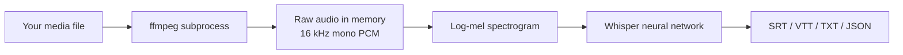

# video-watcher

Local captions (SRT, VTT, TXT) for audio and video via [OpenAI Whisper](https://github.com/openai/whisper). No API key.

**Input formats:** anything **ffmpeg** can decode. List known extensions:

```bash
./video-watcher --list-inputs
```

| Video | Audio |
|-------|-------|
| mp4, mkv, webm, mov, avi, m4v, flv, ts, m2ts | mp3, wav, flac, ogg, opus, m4a, aac, wma |

Other `audio/*` or `video/*` files (by MIME type) are accepted too.

## How it works

`video-watcher` runs [OpenAI Whisper](https://github.com/openai/whisper) on your file. **ffmpeg** decodes the audio; **Whisper** transcribes it. There is no intermediate MP3 on disk — audio stays in memory.



1. **ffmpeg** reads the media file (video or audio), extracts the audio track, and streams **mono 16 kHz PCM** to Python via a pipe (not a temp file).
2. Whisper converts that waveform into a **log-mel spectrogram** — the representation the model was trained on.
3. The **Whisper model** processes the spectrogram in ~30 second chunks and predicts text (optionally forced to a language with `-l`).
4. Caption files are written next to the input (or under `-o`).

`video-watcher` only adds CLI conveniences (model, language, output dir, GPU). `video-watcher-docker` runs the same pipeline inside a container that bundles ffmpeg, PyTorch, and Whisper.

## Scripts

| Script | Path | Purpose |
|--------|------|---------|
| **video-watcher-docker** | Docker | Check deps, build image, transcribe (auto GPU) |
| **install-local** | Local | Install CPU Whisper into `.venv` |
| **install-gpu** | Local | Install AMD ROCm PyTorch + Whisper into `.venv` |
| **video-watcher** | Local | Transcribe videos (after install) |

```
video-watcher/
  vw/                     # Python package (CLI, progress bar, transcribe)
  video-watcher-docker    # Docker: check → build → run
  install-local           # Local CPU setup
  install-gpu             # Local AMD GPU setup
  video-watcher           # Launcher → python -m vw
  .venv/                  # Created by install-* scripts
```

## Docker (recommended)

```bash
./video-watcher-docker                              # check + build image
./video-watcher-docker ~/Downloads/your-video.mp4   # transcribe
./video-watcher-docker -m small -l en ~/Downloads/talk.mp4
./video-watcher-docker --check                      # dependency report only
```

## Local (native)

```bash
./install-local
./video-watcher ~/Downloads/your-video.mp4
```

### AMD GPU (local)

```bash
./install-gpu
./video-watcher --gpu -m small ~/Downloads/your-video.mp4
```

Reinstall ROCm stack: `./install-gpu --force`

If GPU is not detected on RX 6800 / Navi 21:

```bash
export HSA_OVERRIDE_GFX_VERSION=10.3.0
./install-gpu --force
```

## Options (`video-watcher` / `video-watcher-docker`)

| Flag | Meaning |
|------|---------|
| `-m small` | Better accuracy, slower |
| `-l en` | Force English |
| `--gpu` | Use GPU (local: after `install-gpu`; docker: automatic when available) |
| `--verbose` | Print live transcript text instead of the progress bar |
| `-o ./out` | Output folder for caption files |
| `--summary` | After transcribe: summarize `.txt` with llama.cpp + Mermaid diagrams |
| `--summary-model` | Summary model key (default: `gemma-4-e4b`; more models later) |

## Convenience symlink

From anywhere:

```bash
~/Downloads/vw ~/Downloads/foo.mp4
```

(`vw` → `video-watcher/video-watcher` for local, or point at `video-watcher-docker` for Docker)

## Docker images (manual)

`./video-watcher-docker` handles this automatically.

| Image | Dockerfile | GPU |
|-------|------------|-----|
| `video-watcher:cpu` | `Dockerfile` | — |
| `video-watcher:nvidia` | `Dockerfile.nvidia` | NVIDIA + [Container Toolkit](https://docs.nvidia.com/datacenter/cloud-native/container-toolkit/install-guide.html) |
| `video-watcher:rocm` | `Dockerfile.rocm` | AMD `/dev/kfd` + `/dev/dri` |

### Run as your user

Containers start as **your UID/GID** (`--user $(id -u):$(id -g)` on Docker, `--userns=keep-id` on Podman), so caption files on mounted folders are owned by you, not root.

Whisper models are cached on the host at `~/.video_watcher/whisper` (set `VIDEO_WATCHER_CACHE` to use a different folder). The directory is created automatically on first run.

## Summarize transcript (`--summary`)

After transcription, optionally summarize the `.txt` output with **llama.cpp** (default model: **Gemma 4 E4B** GGUF).

**Requires:** `llama-cli` on `PATH`, or set `VIDEO_WATCHER_LLAMA_CLI` to your build (e.g. `~/llama.cpp/build/bin/llama-cli`).

```bash
./video-watcher -m small -l en --summary ~/Downloads/talk.mp4
# → talk.txt + talk.20260519-153045.summary.md (timestamp avoids overwrite)
# Summary markdown is printed to the terminal and saved to the file.
# A second pass adds Mermaid diagrams (flowchart, sequence, ER, etc.) for graph-worthy blocks.
```

The GGUF is downloaded once to `~/.video_watcher/llama/` (~5 GB for Gemma 4 E4B Q4). Use `--gpu` so both Whisper and the summarizer can use the GPU. More summary models will be added later (`--summary-model`).

## Features

### Transcription

- **Local Whisper** — no API key or cloud; ffmpeg pipes mono 16 kHz PCM into Whisper (no temp audio file)
- **Multiple caption formats** — SRT, VTT, TXT, JSON, TSV (`-f` or `all`)
- **Audio and video inputs** — mp4, mkv, mp3, wav, ogg, flac, and more; `--list-inputs` for the full set
- **Configurable Whisper models** — `tiny` through `large`, plus language forcing (`-l en`)
- **Progress bar** — time-based bar with ETA; `--verbose` for live transcript text instead
- **Batch-friendly** — transcribe several files in one command

### Summarization (`--summary`)

- **llama.cpp + GGUF** — local summarization with **Gemma 4 E4B** (default); no Ollama/vLLM required
- **Two-pass output** — (1) markdown summary with overview + key points, (2) **Mermaid diagrams** for graph-worthy blocks (flowchart, sequence, ER, state, mindmap, etc.; multiple diagrams when needed)
- **Timestamped files** — `name.YYYYMMDD-HHMMSS.summary.md` so reruns never overwrite prior summaries
- **Terminal + file** — full markdown printed to stdout and saved beside the transcript
- **Extensible models** — `--summary-model` registry in `vw/constants.py` (more models later)
- **GGUF cache** — weights under `~/.video_watcher/llama/` (~5 GB on first run)
- **`VIDEO_WATCHER_LLAMA_CLI`** — point at your `llama-cli` build if it is not on `PATH`

### Runtime & deployment

- **Docker or native** — `video-watcher-docker` (check → build → run) or `video-watcher` + `install-local`
- **GPU auto-detection (Docker)** — CPU, NVIDIA, or AMD ROCm image + device passthrough
- **AMD ROCm (local)** — `install-gpu` for RX / Radeon on Linux (`HSA_OVERRIDE_GFX_VERSION` for Navi 21)
- **Runs as your user (Docker)** — captions and cache owned by you, not root
- **Model cache** — Whisper under `~/.video_watcher/whisper` (`VIDEO_WATCHER_CACHE` to relocate)
- **Dependency checks** — `video-watcher-docker --check`
- **Native fallback** — Docker failure retries with host `.venv`
- **Podman-compatible** — `CONTAINER_RUNTIME=podman`
- **Structured Python package** — `vw/` (CLI, transcribe, progress, summary, cache)
